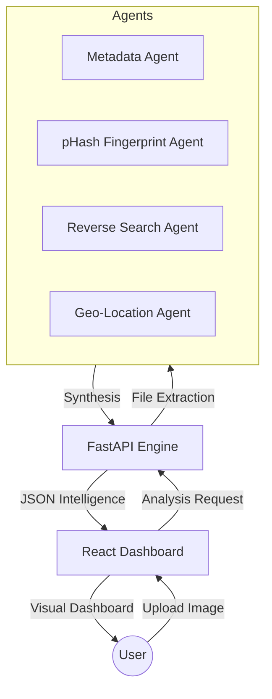

# 🌐 ImageTrace OSINT Platform

**ImageTrace OSINT Platform** is a state-of-the-art, web-based, multi-agent intelligence platform designed for forensic image analysis and open-source intelligence (OSINT).

🚀 **Built for:** Cyber-crime investigators, journalists, and forensic analysts.

---

## 🧠 Core Intelligence Capabilities

1.  **Forensic Metadata Extraction**: Deep-dive into EXIF/XMP/IPTC data to recover camera models, software signatures, and original timestamps.
2.  **GPS Geo-Inference**: Automatic extraction and mapping of GPS coordinates from image metadata with interactive visualization.
3.  **Digital Fingerprinting (pHash)**: Generation of unique perceptual hashes to identify "digital clones" even if they have been resized or compressed.
4.  **Reverse Image Search**: Orchestrated backtracking of image origins across global search engines (Simulated Agent).
5.  **Perceptual Matching**: Identification of visually similar images using deep embeddings and cosine similarity.
6.  **Timeline Reconstruction**: Historical analysis of an image's appearance and modifications over time.
7.  **Automated Investigative Reporting**: One-click generation of comprehensive PDF cases.

---

## 🏗️ System Architecture



---

## 🧱 Repository Structure

```text
imagetrace-osint/
├── backend/            # FastAPI Intelligence Engine
│   ├── agents/         # AI/Script Agents (Processing Logic)
│   ├── uploads/        # Temporary storage for analysis
│   ├── main.py         # API Gateway & Orchestration
│   └── requirements.txt
├── frontend/           # React Fiber Dashboard
│   ├── src/            # Components & Logic
│   └── public/         # Static assets
├── docker/             # Orchestration configs
└── README.md
```

---

## 🚀 Quick Start & Installation

### 🐳 Using Docker (One-Click)
```bash
docker-compose up --build
```
Access the dashboard at `http://localhost:3000`.

### 💻 Manual Local Setup

#### 1. Requirements
- Python 3.10+
- Node.js 18+

#### 2. Backend Setup
```bash
cd backend
python -m venv venv
source venv/bin/activate  # Or .\venv\Scripts\activate on Windows
pip install -r requirements.txt
uvicorn main:app --reload
```

#### 3. Frontend Setup
```bash
cd frontend
npm install
npm run dev
```

---

## 🔎 Investigation Workflow
1.  **Ingest**: Drop an image file or paste a social media URL into the dashboard.
2.  **Analyze**: ImageTrace runs extraction agents (EXIF, Hash, etc).
3.  **Visualise**: View results on the interactive map and metadata panel.
4.  **Export**: Download the generated investigation PDF for case files.

---

## 🛡️ License
Distributed under the **MIT License**. See `LICENSE` for more information.

## 🤝 Contributing
Contributions are what make the open source community such an amazing place to learn, inspire, and create. Any contributions you make are **greatly appreciated**.

---

*Designed with ❤️ for the Global OSINT Community.*
